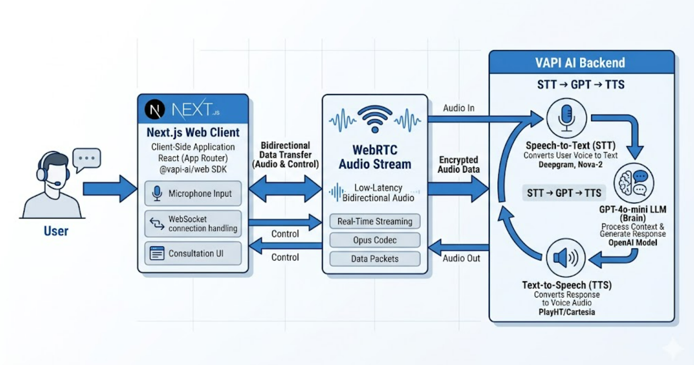
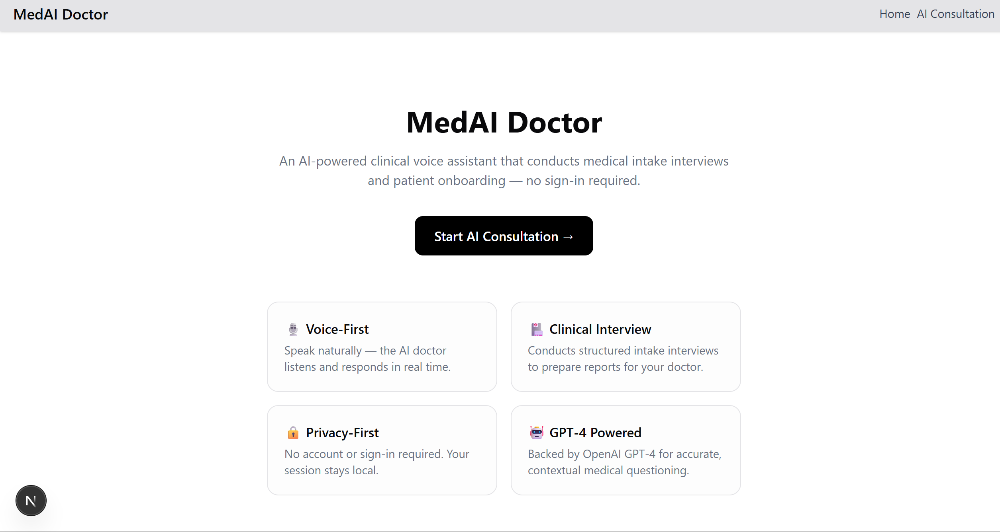
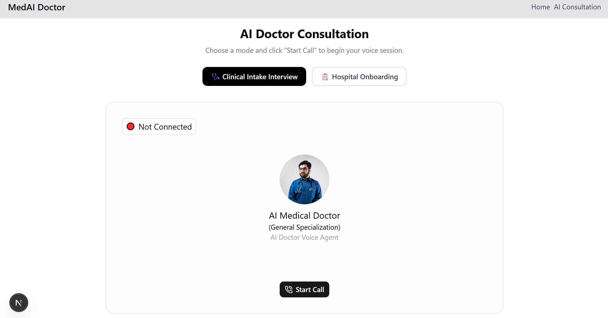

# 🏥 MedAI Doctor

An AI-powered, voice-enabled conversational intake system that automates critical clinical data collection via low-latency WebRTC streams. MedAI Doctor serves as a patient-facing portal within a broader telemedicine workflow, designed to bridge healthcare access gaps through natural voice interaction.

## Features

* **Voice Interaction:** Native, intuitive voice conversation using VAPI AI and WebRTC.
* **Structured Interviews:** Conducts clinical intake (e.g., 20-question patient interviews) and gathers comprehensive demographics.
* **PCP Reports:** Prepares detailed patient reports for Primary Care Physicians.
* **Hospital Onboarding:** Manages complete hospital onboarding data collection.
* **Zero-Auth Connection:** Offers immediate, direct connection without complex login/authentication.

---

## 🏗️ System Architecture & Workflow



---

## Interface Preview

#### The Landing Portal


#### Live Clinical Voice Session


## 🌟 Origin Story: AIML Volunteering Impact

This application was developed as a technical solution to support Primary Care Physicians (PCPs) serving rural demographics during an AIML volunteering engagement. By automating the time-consuming symptom and demographic collection during triage, MedAI Doctor allows clinical staff to focus on high-acuity patient interaction.

The goal of this initiative was to prove that natural, multilingual voice interfaces could bypass the barriers that often make traditional web portals and forms inaccessible to diverse patient populations.

## 🛠️ Technical Stack

* **Frontend:** Next.js 15, React, Tailwind CSS (Custom Light Theme configuration)
* **Orchestration:** VAPI AI Orchestration Hub (STT/TTS Processing)
* **LLM Engine:** OpenAI `gpt-4o-mini` (Configured via zero-shot system prompts for rapid, accurate response times and strict clinical boundaries)
* **Streaming:** WebRTC (low-latency bidirectional audio)

## 💻 Local Development

### 1. Repository Setup
```bash
git clone https://github.com/UtkarshJain05/medai-doctor.git
cd medai-doctor
npm install
```

### 2. Environment Configuration
Create a local environment file to store your API keys securely:
```bash
cp .env.example .env.local
```
Add your public token from the VAPI Dashboard:
```text
NEXT_PUBLIC_VAPI_API_KEY=your_public_token_here
```

### 3. Execution
Start the Next.js development server:
```bash
npm run dev
```
The application will be available at `http://localhost:3000`.

---
*Disclaimer: This system is a technical prototype designed for data collection and triage routing demonstrations. It is programmed to strictly avoid providing direct medical diagnoses or advice.*